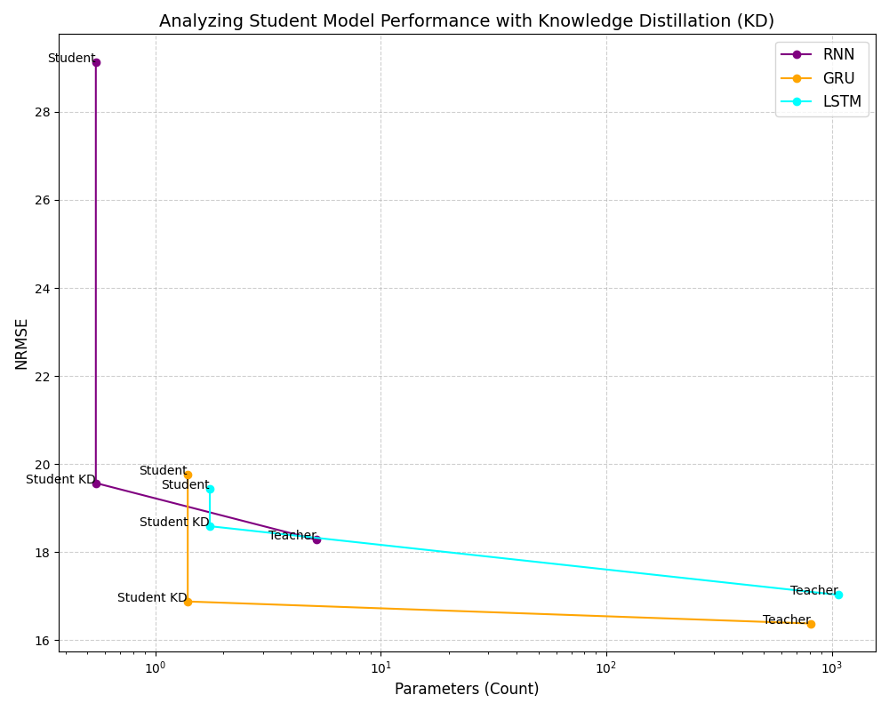
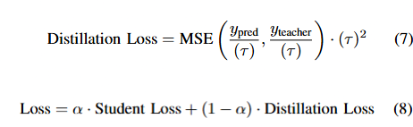

# ⚡ OPTIMIZING LIGHTWEIGHT PHOTOVOLTAIC FORECASTING MODELS: A DISTILLATION APPROACH

**Authors:**  
Ifran Rahman Nijhum<sup>1,2</sup>, Toluwabori Akinola<sup>2</sup>, Md Emon Ali<sup>3</sup>, Soumyabrata Dev<sup>1,2</sup>  
<sup>1</sup> The ADAPT SFI Research Centre, Dublin, Ireland  
<sup>2</sup> School of Computer Science, University College Dublin, Dublin, Ireland  
<sup>3</sup> Department of Electrical and Electronic Engineering, Rajshahi University of Engineering and Technology, Bangladesh  

📧 ifran.nijhum@ucdconnect.ie | toluwabori.akinola@ucdconnect.ie | emon1601098@gmail.com | soumyabrata.dev@ucd.ie  

---

## 🔎 Abstract
Solar is the largest renewable energy source, yet its highly intermittent nature poses difficulties for efficient integration into grids. Hence, accurate solar forecasting is crucial for maximizing energy efficiency. Deep learning models have shown tremendous success in solar forecasting, nonetheless, they are typically large and computationally complex.  

In this research, we propose a **novel knowledge distillation method** for enhancing **lightweight time-series solar forecasting models**. Specifically:  

- Applied to **RNN, LSTM, and GRU** architectures.  
- Each lightweight *student* model distills knowledge from its accurate *teacher* model.  
- Demonstrated **significant error reductions**:  
  - RNN student (90% fewer parameters) → **9.56% lower NRMSE**, **19.53% lower MAPE**.  
  - LSTM and GRU students also improved substantially.  

These results highlight the potential of the proposed method in creating **highly efficient, real-time, edge-deployable forecasting models**.  

---

## 📈 Results
**Improvement of the lightweight student models after applying the proposed knowledge distillation (KD) method**  

  

---

## 🧠 Proposed Distillation Method

Traditional distillation is well-studied in classification, but not directly suitable for regression tasks like solar forecasting.  
We propose a **new regression-oriented distillation strategy**:

<p align="left">
  
</p>


### 📌 Algorithm (pseudo-code)

```python
# Knowledge Distillation for Time-Series Forecasting

mse = MeanSquaredError()

# Compute predictions by the teacher model (frozen)
teacher_pred = self.teacher(x, training=False)

# Compute student (hard) loss: MSE between true labels and student predictions
student_loss = mse(y, y_pred)

# Temperature scaling for distillation
temp = self.temperature

# Compute distillation (soft) loss
distill_loss = mse(y_pred / temp, teacher_pred / temp) * (temp ** 2)

# Final combined loss
loss = self.alpha * student_loss + (1 - self.alpha) * distill_loss

```


### 📖 Citation

If you use this work in your research, please cite:
```
@inproceedings{nijhum2025solarkd,
  author    = {Nijhum, Ifran Rahman and Akinola, Toluwabori and Ali, Md Emon and Dev, Soumyabrata},
  title     = {Optimizing Lightweight Photovoltaic Forecasting Models: A Distillation Approach},
  booktitle = {Proceedings of the 2025 IEEE International Geoscience and Remote Sensing Symposium (IGARSS)},
  year      = {2025},
  address   = {Brisbane, Australia},
  month     = {Aug.},
  publisher = {IEEE},
  note      = {To appear}
}

```
